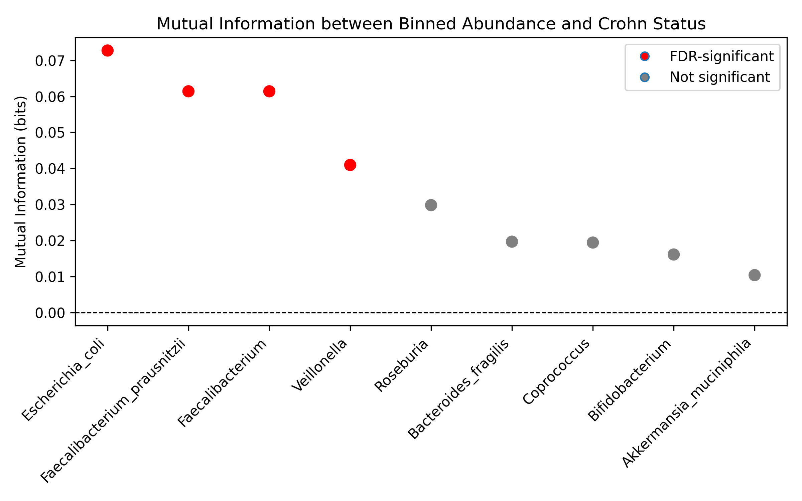

# Mutual Information Between Gut Bacterial Abundance and Crohn’s Disease Status

## Overview 
This project assesses whether knowing the abundance of selected gut bacteria well-documented in IBD research reduces uncertainty in Crohn’s disease status. Using shotgun metagenomics–derived microbial relative abundance of the 9 selected bacteria, I computed mutual information with 10,000 permutations to assess significance, and applied false discovery rate (FDR) control to account for multiple hypothesis testing. 

## Data 
- Source: GMrepo (Project PRJEB42155)
- Samples: 132 unique tube_ids (18 Healthy, 114 Crohn’s Disease)
- Attributes: tube_id, diagnosis (Crohn’s disease, healthy), shotgun metagenomics–derived microbial relative abundance of the 9 selected bacteria 

## Methods
1. Filtered data to obtain healthy controls vs Crohn’s disease
2. Binned relative abundance into 3 bins (zero, low, high)
3. Calculated the mutual information between each bacterium and disease status
4. Ran permutation tests (10,000 permutations) to assess significance
5. Corrected for multiple hypothesis testing with FDR correction 

## Results
Mutual information values were low across all taxa, indicating substantial overlap between Crohn’s disease and healthy samples, with only a subset remaining significant after FDR correction.

## Requirements
- Python 3.10+
- pandas >= 2.0
- matplotlib >= 3.9

## Repository Structure
- /data/ … 
- /figures/ … 
- /results/ … 
- /scripts/ … 
- README.md … 

## License
MIT

## Acknowledgments
Course: CSDS 313 – Intro to Data Analysis, Instructor Dr. Mehmet Koyuturk
